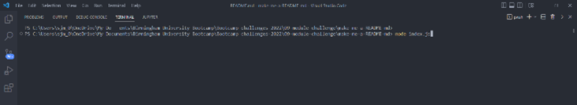
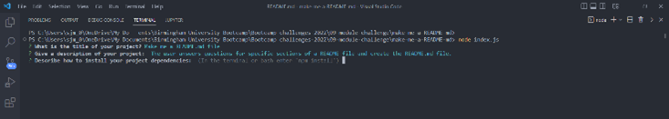
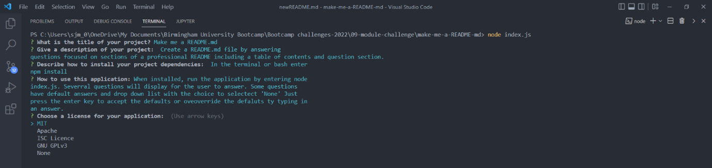
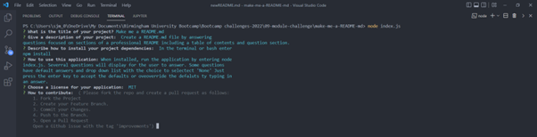
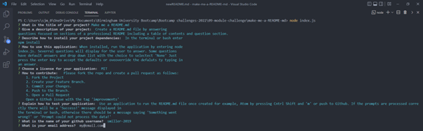
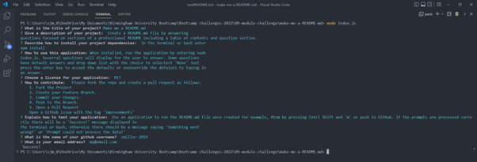
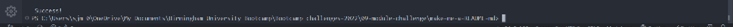

# make-me-a-README-md

## Description

Displays questions and takes the user answers to auto generate a README.md file. The questions focus on the sections needed for a professional README guide so, it will make it easier and quicker to generate a README.md file with relevant details for any software project. Developing this project was useful in learning how to use literal templates for more complex content, using inquirer API and learning more about README.md files and their uses.

## Table of Contents (Optional)

- [Installation](#installation)
- [Usage](#usage)
- [License](#license)
- [Contributing](#contributing)
- [Tests](#tests)
- [Questions](#questions)

## Installation

Use the command 'npm install' to install inquirer API

## Usage

The following images show a step by step process to using the 'make me a newREADME.md' project:
Run command node index.js

Answer questions when prompted to do so or press enter to accept the default:

Use the arrow keys to select from the list of licenses:

Continue to answer questions when prompted to do so or press enter to accept the default:

After entering the answer to the last question, then press enter:

Success:

[Walkthrough video](https://drive.google.com/file/d/1VqZX4PE7AFxbgvT-k3eWlDDr9LRhhk8j/view?usp=sharing)

## License

MIT License

Copyright (c) 2022 smiller-2019

Permission is hereby granted, free of charge, to any person obtaining a copy
of this software and associated documentation files (the "Software"), to deal in the Software without restriction, including without limitation the rights to use, copy, modify, merge, publish, distribute, sublicense, and/or sell copies of the Software, and to permit persons to whom the Software is
furnished to do so, subject to the following conditions:

The above copyright notice and this permission notice shall be included in all copies or substantial portions of the Software.

THE SOFTWARE IS PROVIDED "AS IS", WITHOUT WARRANTY OF ANY KIND, EXPRESS OR
IMPLIED, INCLUDING BUT NOT LIMITED TO THE WARRANTIES OF MERCHANTABILITY,
FITNESS FOR A PARTICULAR PURPOSE AND NONINFRINGEMENT. IN NO EVENT SHALL THE
AUTHORS OR COPYRIGHT HOLDERS BE LIABLE FOR ANY CLAIM, DAMAGES OR OTHER
LIABILITY, WHETHER IN AN ACTION OF CONTRACT, TORT OR OTHERWISE, ARISING FROM, OUT OF OR IN CONNECTION WITH THE SOFTWARE OR THE USE OR OTHER DEALINGS IN THE SOFTWARE.

## Contributing

Please fork the repo and create a pull request as
follows: 1. Fork the Project 2. Create your Feature Branch. 3. Commit your Changes. 4. Push to the Branch. 5. Open a Pull Request
Open a Github issue with the tag 'improvements'

## Tests

The word 'Success!' displays in the terminal if all prompts entered has been processed correctly:

The message 'Something went wrong!' displays if an error occurred other than a isTtyError:

The message 'Prompt could not process the data!' displays if a isTtyError occures, hence the prompts could not be processed.

## Questions

If there are any further questions, please use the following contacts:

Email: myEmail@gmail.com
GitHub Profile: smiller-2019 https://github.com/smiller-2019
GitHub Repository: smiller-2019 https://github.com/smiller-2019
